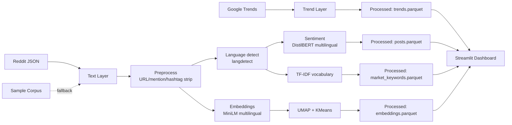

# Methodology

## Research question

> Does the same fashion aesthetic mean the same thing across cultures?

The aesthetic under study is **quiet luxury**: a restrained, high-quality,
logo-averse mode of dressing often associated with "old money" style.
The comparison is across four culturally distinct markets:

| Market | Language | Sample vocabulary |
|---|---|---|
| New York (US) | English | *quiet luxury*, *old money aesthetic*, *stealth wealth*, *understated luxury* |
| Paris (FR) | French | *luxe discret*, *style old money*, *luxe silencieux* |
| Seoul (KR) | Korean | *올드머니룩*, *조용한 럭셔리*, *미니멀 럭셔리* |
| Tokyo (JP) | Japanese | *クワイエットラグジュアリー*, *オールドマネー ファッション*, *上品カジュアル* |

All keyword variants map back to a single canonical aesthetic
so cross-lingual signals can be compared on the same axes.

## Data sources

Two independent layers are combined:

1. **Trend layer** — Google Trends via `pytrends`. Country-scoped
   interest-over-time from 2023-01 through 2026-06, monthly granularity.
2. **Text layer** — Reddit public JSON search endpoints for public,
   non-logged-in content. Reddit is the only major platform whose Terms of
   Service explicitly permit scraping of public content, which makes it the
   safest primary text source for a portfolio project.

TikTok, Instagram, and X are intentionally excluded from the primary pipeline.
They are visually relevant but rely on fragile scraping that violates ToS
and breaks frequently.

## Processing pipeline

## Models

| Task | Model | Rationale |
|---|---|---|
| Sentiment | `tabularisai/multilingual-sentiment-analysis` | Native support for English, French, Korean, and Japanese with a 5-class scale (Very Negative → Very Positive). No translate-then-classify drift. |
| Embeddings | `sentence-transformers/paraphrase-multilingual-MiniLM-L12-v2` | Shared multilingual embedding space so posts across all four markets can be placed on the same 2D projection. |
| Dimensionality reduction | UMAP (cosine metric) | Preserves local neighborhood structure better than PCA for text embeddings. |
| Clustering | KMeans | Simple, interpretable, deterministic. Number of clusters is capped as `min(6, n // 8)` to avoid over-splitting small corpora. |

## Metrics

- **Search interest** (0–100 per region, from Google Trends).
- **Sentiment index** (`sentiment_score`, -1 to +1, arithmetic mean of the
  transformer's calibrated per-class scores).
- **Vocabulary specificity** (TF-IDF with each market treated as one document).

## Ethics and platform respect

- Only public, non-logged-in content is used.
- The checked-in sample corpus is synthetic; no real user posts are
  redistributed with this repository.
- The Reddit collector uses the platform's public JSON endpoints, which
  Reddit's Terms of Service explicitly permit.
- Live pulls are rate-limited with an easily configurable
  `sleep_between` parameter.

## Reproducibility

- All random operations are seeded (NumPy default RNG seed 42, langdetect
  seed 42, KMeans random_state 42).
- The pipeline gracefully falls back to heuristic sentiment and hashed
  embeddings when heavy dependencies are missing, so a reviewer can still
  demo the dashboard on a minimal environment (`requirements-lite.txt`).

## Known limitations

- Reddit skews Anglophone, so the Korean and Japanese text signals in the
  live-data mode are lighter than the US/FR ones. Adding locale-specific
  sources (Naver, Yahoo Japan) is the natural next iteration.
- Google Trends values are normalized per region and are *not* comparable in
  absolute terms across regions. The dashboard makes this explicit in the
  caption of the interest-over-time chart.
- Sentiment classifiers trained on general social text may miss
  fashion-specific irony. A small hand-labeled fashion test set would be a
  worthwhile follow-up.
