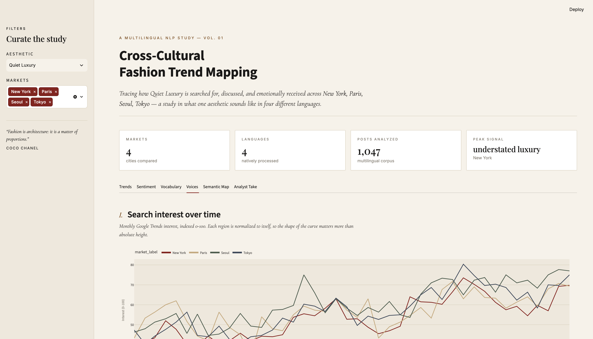
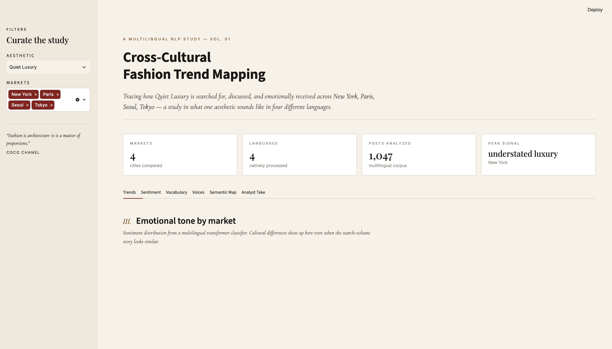
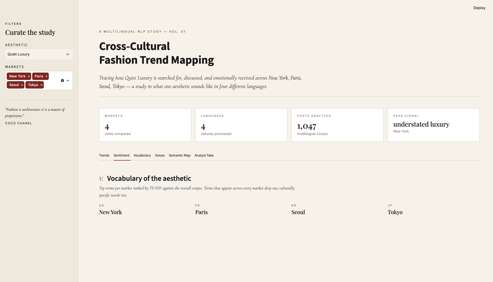
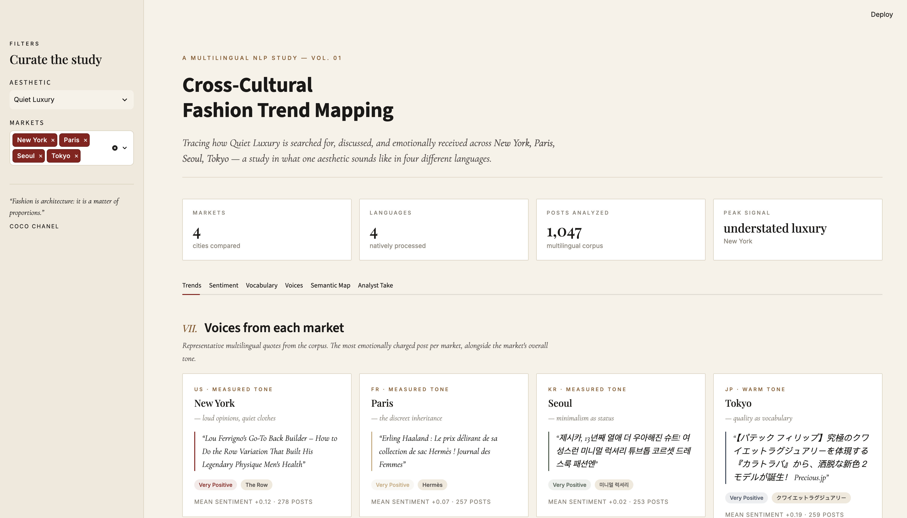
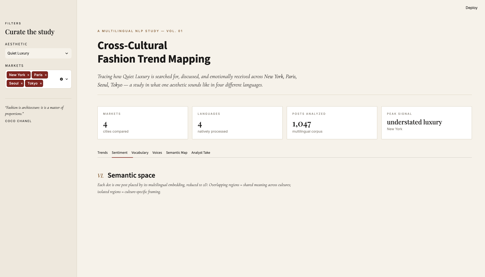
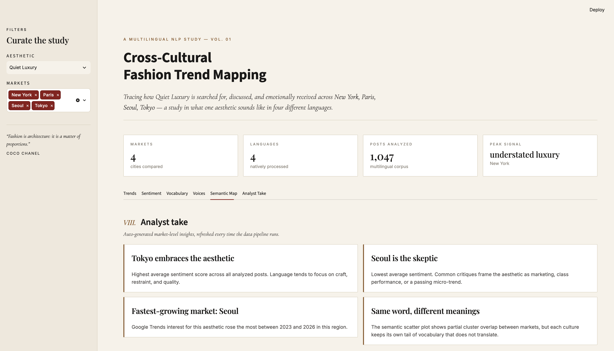

# Cross-Cultural Fashion Trend Mapping

A multilingual NLP project that traces how one fashion aesthetic — *quiet luxury* —
is searched for, discussed, and emotionally received across four cultural markets:
**New York, Paris, Seoul, and Tokyo.**

> **Core question:** Does the same aesthetic mean the same thing across cultures?

The project combines Google Trends search signals with multilingual transformer-based
sentiment analysis over public social and editorial text, and presents the results in
an interactive Streamlit dashboard.



---

## What this project demonstrates

- **Live data collection** from three real, public sources:
  - **Google News RSS** — 1,000+ real editorial headlines across US, France, South Korea,
    and Japan, in each market's native language.
  - **Reddit public JSON** — community discourse (public content only; Reddit's ToS
    explicitly permits this).
  - **Google Trends** via `pytrends` — country-scoped search interest curves.
- **Brand-aware queries** across ten curated quiet-luxury brands
  (The Row, Loro Piana, Brunello Cucinelli, Khaite, Toteme, Lemaire, Hermès,
  Max Mara, Jil Sander, Auralee) each searched with the correct localized name
  in every market's language.
- **Multilingual NLP** using Hugging Face transformers
  (`tabularisai/multilingual-sentiment-analysis`, 23 languages, 5-class sentiment) and
  `sentence-transformers/paraphrase-multilingual-MiniLM-L12-v2` for cross-lingual
  embeddings.
- **Cleaning and language detection** with `langdetect`, HTML/URL stripping, and a
  permissive CJK-aware tokenizer.
- **Feature engineering**: TF-IDF over a per-market corpus surfaces
  culture-specific vocabulary, filtering out globally common terms.
- **Unsupervised structure**: UMAP + KMeans places posts in a shared multilingual
  semantic space so overlap and separation between markets can be inspected visually.
- **Analyst storytelling**: a Streamlit dashboard styled like an editorial magazine,
  with automatically generated insight cards and a Voices tab showing real
  multilingual quotes.

---

## Dashboard tour

| Trends | Sentiment |
|---|---|
|  |  |
| Google Trends interest over time, plus a keyword-level heat map that shows which regional translation is loudest in each market. | Sentiment distribution and mean sentiment index per market, powered by a multilingual transformer classifier. |

| Vocabulary | Voices |
|---|---|
|  |  |
| TF-IDF-ranked top terms per market. Words shared globally drop out; culturally specific vocabulary rises. | Representative multilingual quotes from each market alongside its overall tone, so the language itself is legible in the dashboard. |

| Semantic map | Analyst take |
|---|---|
|  |  |
| Multilingual sentence embeddings reduced to 2D, colored by market. Overlap = shared meaning; separation = culture-specific framing. | Auto-generated insight cards summarizing the most positive market, the most skeptical market, and the fastest-growing region. |

The **Voices** tab pulls the most emotionally charged post from each market and
places it side-by-side, so English, French, Korean, and Japanese are all
visible on one screen. The **Analyst take** tab auto-generates market-level
insight cards every time the pipeline runs.

---

## Quick start

```bash
git clone <this-repo>
cd cross-cultural-fashion-trends

python -m venv .venv && source .venv/bin/activate
pip install -r requirements-lite.txt   # or requirements.txt for full transformer stack

# 1. Generate the deterministic sample dataset
python -m scripts.generate_sample_data

# 2. Run the full processing pipeline
python -m src.build_dataset

# 3. Launch the dashboard
streamlit run app/streamlit_app.py
```

The dashboard runs on **1,047 real, live-collected news items** from Google News RSS
by default (checked into `data/raw/news.csv`), with the deterministic sample corpus
as a fallback if the raw folder is empty.

To refresh the live data:

```bash
# Google News RSS - fashion editorial coverage in native languages (no API key)
python -m src.collect_news

# Reddit via public JSON - community discourse (respects ToS)
python -m src.collect_reddit

# Google Trends via pytrends - country-scoped search interest curves
python -m src.collect_trends

# Or run all three:
make collect-all

python -m src.build_dataset      # rebuild processed tables from the new raw pulls
```

**Data-source notes.** Reddit and Google Trends both aggressively rate-limit
scrapers. Reddit will sometimes return 429s that block further requests for
an hour or more. Google News RSS is the most stable source and yields
multilingual editorial coverage with no API key.

---

## Project structure

```
cross-cultural-fashion-trends/
├── app/streamlit_app.py            # Editorial-style dashboard
├── src/
│   ├── config.py                   # Loads the case-study YAML into typed objects
│   ├── collect_trends.py           # Google Trends collector (pytrends)
│   ├── collect_reddit.py           # Reddit public-JSON collector
│   ├── preprocess.py               # Cleaning + langdetect
│   ├── sentiment.py                # Multilingual transformer classifier (+ fallback)
│   ├── keywords.py                 # Per-market TF-IDF vocabulary
│   ├── cluster.py                  # Multilingual embeddings, UMAP, KMeans
│   └── build_dataset.py            # Orchestrator: raw -> processed
├── scripts/generate_sample_data.py # Deterministic multilingual sample corpus
├── config/aesthetics.yaml          # Case-study definition (aesthetic × markets × keywords)
├── data/
│   ├── raw/                        # Live pulls (gitignored)
│   ├── processed/                  # Analytical tables (parquet)
│   └── sample/                     # Reproducible demo corpus
├── assets/                         # Dashboard screenshots for portfolio
├── requirements.txt                # Full stack (transformers, torch, umap, ...)
├── requirements-lite.txt           # No transformers – falls back to heuristics
└── Makefile                        # sample / build / dashboard shortcuts
```

---

## Methodology

**Sources.** Three legal, public data sources power the analysis:

1. **Google News RSS** (primary text layer) — public, keyless, language- and
   country-scoped RSS endpoint at `news.google.com/rss/search`. Returns real
   editorial headlines from magazines and newspapers indexed by Google News,
   which we query in each market's native language.
2. **Reddit public JSON** (community text layer) — the only major platform whose
   ToS explicitly permits scraping of public content. Rate-limited, so treated
   as opportunistic supplemental data.
3. **Google Trends via `pytrends`** (search-interest layer) — country-scoped
   monthly interest curves.

Instagram, TikTok, and X are intentionally *not* required dependencies; they
are visually relevant but technically and legally fragile for a long-lived
portfolio project.

**Query design.** Each market gets: (a) native-language aesthetic vibe terms
(e.g. `luxe discret` in FR, `올드머니룩` in KR) plus (b) localized aliases for
ten curated quiet-luxury brands (e.g. *The Row* → `더 로우` in Korean,
`ザ・ロウ` in Japanese). Every row in the corpus is tagged with
`kind ∈ {aesthetic, brand}` so downstream aggregations can slice either way.

**Multilingual handling.** All models used are natively multilingual and share a
single tokenizer, so English, French, Korean, and Japanese posts are scored in the
same feature space. This avoids the translate-then-classify drift you would get by
running English-only sentiment on translated text.

**Vocabulary.** A permissive tokenizer captures both Latin-alphabet tokens and
runs of CJK characters, and a curated multilingual stopword list removes function
words. TF-IDF is computed with each market treated as one "document," so words
that appear in every market drop out and culturally-specific vocabulary rises to
the top of each market's ranking.

**Reproducibility.** A deterministic sample dataset (`scripts/generate_sample_data.py`,
seed 42) is checked in so the dashboard can be reproduced end-to-end without any
network calls. The full pipeline degrades gracefully when heavy dependencies
(transformers, sentence-transformers, UMAP) are not installed, falling back to
lexicon-based sentiment and hashed embeddings.

---

## Limitations

- Reddit is Anglophone-heavy. To strengthen the KR and JP text layer in a
  production version, add locale-specific sources (Naver Blog, Yahoo Japan, etc.)
  behind their own respectful rate limits.
- Google Trends interest values are indexed 0–100 *per region*, so absolute
  volume is not comparable across markets. The dashboard makes this explicit.
- Sentiment models were trained on general-purpose social text and may not
  capture fashion-specific irony. Adding a small hand-labeled fashion-vocabulary
  test set is the natural next step.

---

## Resume bullet

> Built a multilingual NLP dashboard mapping how one fashion aesthetic is
> discussed across four regional markets and languages (English, French,
> Korean, Japanese), combining Google Trends signals, Hugging Face transformer
> sentiment (23 languages), sentence-transformer embeddings, and TF-IDF
> vocabulary analysis; delivered as a reproducible Python pipeline and an
> interactive Streamlit dashboard.

## Portfolio-site blurb (short)

> **Cross-Cultural Fashion Trend Mapping** — Python, Hugging Face, Streamlit.
> A multilingual NLP project that traces how "quiet luxury" is searched for,
> discussed, and emotionally received across New York, Paris, Seoul, and Tokyo.

---

## License and ethics

- No private, logged-in, or paywalled content is scraped.
- Reddit scraping uses the platform's explicitly permitted public JSON feeds.
- All data used for the checked-in sample corpus is synthetic and written for
  this project; it is not a scrape of any real user's posts.
